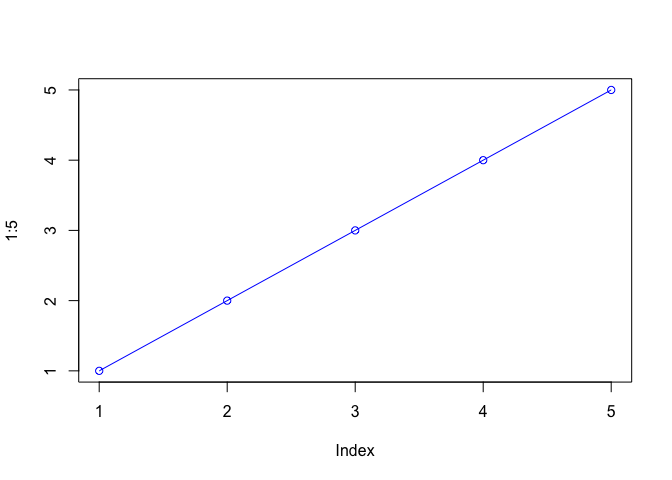
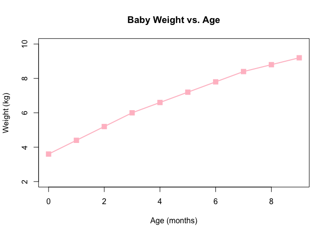
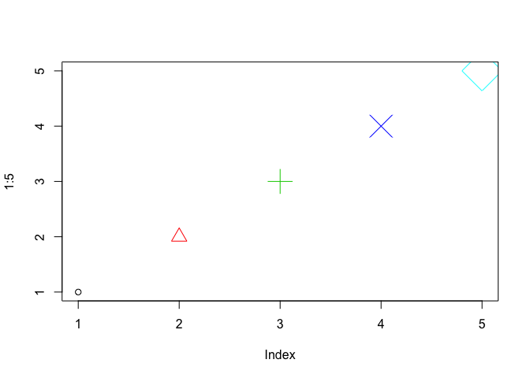
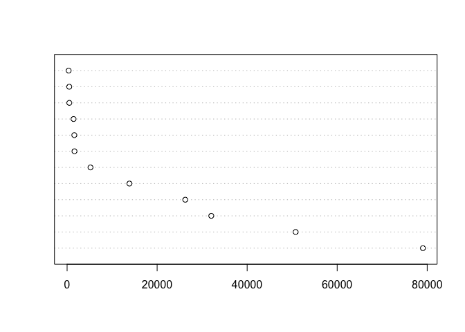
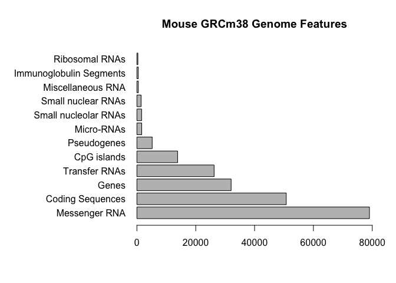
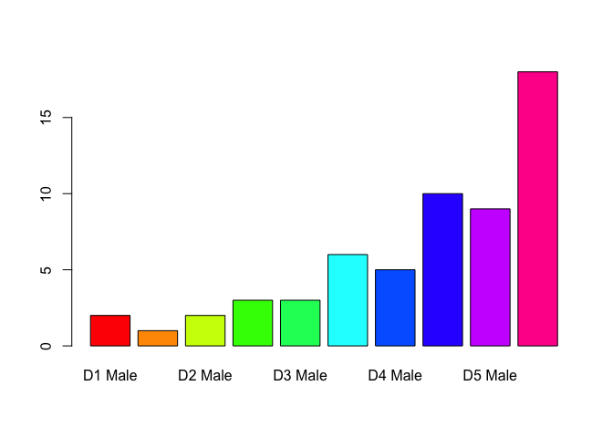
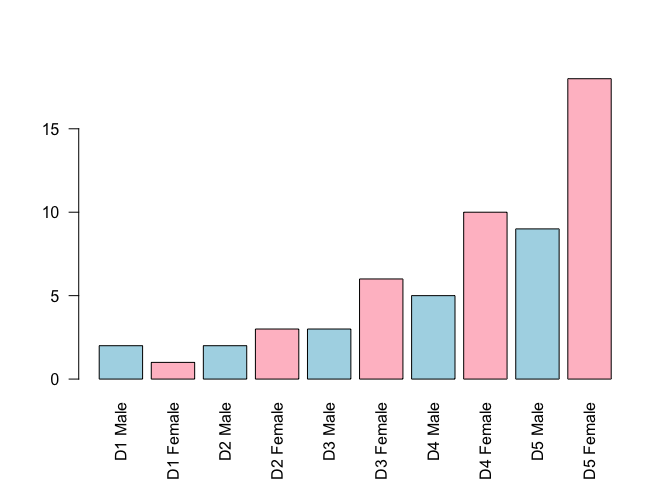

Lecture 05: Data Visualization and Graphics in R
================

Creating a basic line plot
==========================

Plot values (1, 2, 3, 4, 5), make the points circles, and color the data blue.

``` r
plot(1:5, col="blue", typ="o")
```



Plotting data from a table
==========================

Read in data of baby weight vs. age. Use "View(baby)" to view the table.

``` r
baby <- read.table("bimm143_05_rstats/weight_chart.txt", 
                   header = TRUE)
```

Plot baby weight vs. age. Adjust colors, point type/size/shape, axes labels, and title accordingly. Hint: use "?plot" to read more about the plot function in R.

``` r
plot(baby$Age, baby$Weight, col="pink", typ="o", 
     xlab= "Age (months)", ylab= "Weight (kg)",
     ylim= c(2,10), main="Baby Weight vs. Age",
     lwd=2, pch=15, cex=1.5)
```



Example plot

``` r
plot(1:5, pch=1:5, cex=1:5, col=1:5)
```



Creating barplots
=================

Read in mouse feature counts data.

``` r
mouse <- read.table("bimm143_05_rstats/feature_counts.txt", 
                             header = TRUE, sep = "\t")
```

Create a dot plot.

``` r
dotchart(mouse$Count)
```



Create a barplot. Hint: use "?barplot" and "?par()$mar".

``` r
par(mar=c(5.1, 12.1, 4.1, 2.1))
barplot(mouse$Count, horiz = TRUE, ylab="", names.arg = mouse$Feature, 
        main="Mouse GRCm38 Genome Features", las=1, xlim=c(0,80000))
```



Using color in plots
====================

Plot male vs. female counts.

``` r
mf <- read.delim("bimm143_05_rstats/male_female_counts.txt")
barplot(mf$Count, names.arg = mf$Sample, col=rainbow(10))
```



(This is the output of the rainbow function used to color the barplot above.)

``` r
rainbow(10)
```

    ##  [1] "#FF0000FF" "#FF9900FF" "#CCFF00FF" "#33FF00FF" "#00FF66FF" "#00FFFFFF"
    ##  [7] "#0066FFFF" "#3300FFFF" "#CC00FFFF" "#FF0099FF"

Here is a more effective way to write the code: using nrow rather than a set number (since the number of rows can change).

``` r
barplot(mf$Count, names.arg=mf$Sample, col=rainbow(nrow(mf)))
```


Color male data one color and female data another color.

``` r
mf <- read.delim("bimm143_05_rstats/male_female_counts.txt")
barplot(mf$Count, names.arg = mf$Sample, col=c("lightblue", "pink"), las=2)
```


