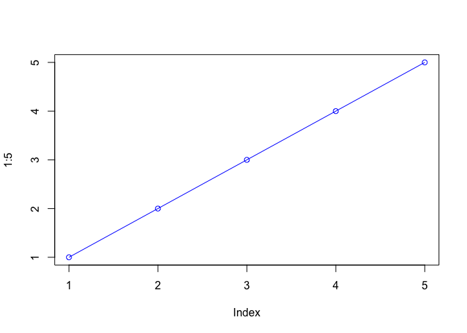
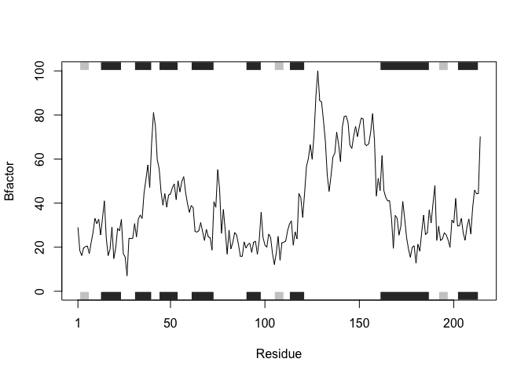
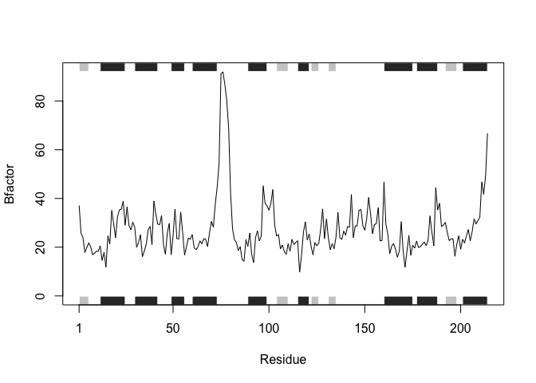
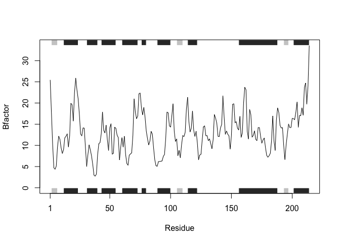
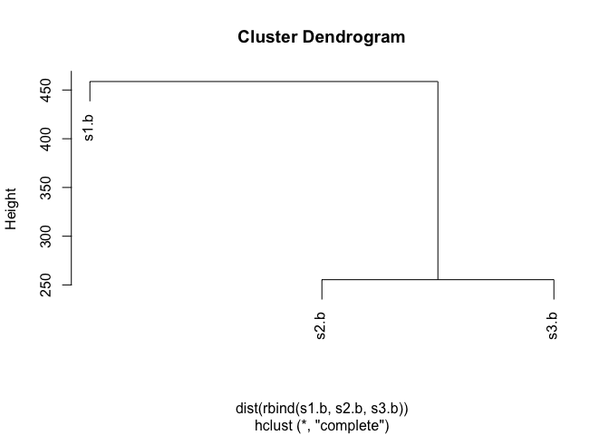
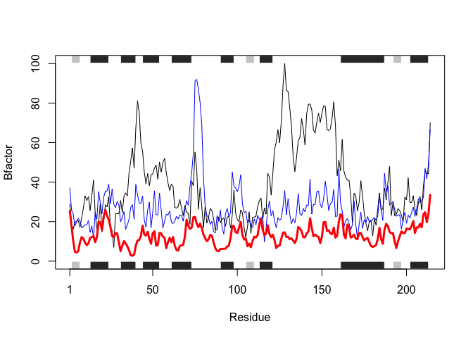

Class 06: Why, when and how of writing your own R functions
================
Sara Elmsaouri
1/24/2020

R Markdown
----------

This is a level 2 heading
-------------------------

This is **regular** old *text*

This is text **bold** with more *text*

and a list of stuff with return caret

-   a
-   list
-   of
-   stuff

``` r
plot(1:5, col="blue", type="o")
```



Let's insert a code chunk with the shortcut `option-cmd-i`:

``` r
x<-c(1:10)
x
```

    ##  [1]  1  2  3  4  5  6  7  8  9 10

``` r
mean(x)
```

    ## [1] 5.5

More on reading input files
---------------------------

We will use the read.table() function

``` r
read.table("test1.txt")
```

    ##               V1
    ## 1 Col1,Col2,Col3
    ## 2          1,2,3
    ## 3          4,5,6
    ## 4          7,8,9
    ## 5          a,b,c

We will use the read.table() function. Look at arguments needed for this data:

``` r
read.table("test1.txt", header = TRUE, sep=",")
```

    ##   Col1 Col2 Col3
    ## 1    1    2    3
    ## 2    4    5    6
    ## 3    7    8    9
    ## 4    a    b    c

``` r
x <- read.table("test1.txt", header = TRUE, sep=",")
```

Alternatively, use read.csv

``` r
read.csv("test1.txt")
```

    ##   Col1 Col2 Col3
    ## 1    1    2    3
    ## 2    4    5    6
    ## 3    7    8    9
    ## 4    a    b    c

and example 2

``` r
x2 <-  read.table("test2.txt", header = TRUE, sep ="$")
x2
```

    ##   Col1 Col2 Col3
    ## 1    1    2    3
    ## 2    4    5    6
    ## 3    7    8    9
    ## 4    a    b    c

and example 3

``` r
x3 <- read.table("test3.txt")
x3
```

    ##   V1 V2 V3
    ## 1  1  6  a
    ## 2  2  7  b
    ## 3  3  8  c
    ## 4  4  9  d
    ## 5  5 10  e

Writing Functions

Our first function
------------------

This is an example function named `add` with input `x` and `y`

``` r
add <- function(x, y=1) {
  # Sum the input x and y
  x + y
}
```

Let's try using it.

``` r
add(6, 4)
```

    ## [1] 10

``` r
add(x=c(1,6,2), y=4)
```

    ## [1]  5 10  6

``` r
add(c(1,6,2), 4)
```

    ## [1]  5 10  6

Range calculates the min and max.

``` r
x <- c(10,4,22,6)
min(x)
```

    ## [1] 4

``` r
max(x)
```

    ## [1] 22

``` r
range(x )
```

    ## [1]  4 22

Another example function to re-scale data to lie between 0 and 10.

``` r
rescale <- function(x) {
  rng <-range(x)
  (x - rng[1]) / (rng[2] - rng[1])
}
```

Testing the function:

``` r
rescale(1:10)
```

    ##  [1] 0.0000000 0.1111111 0.2222222 0.3333333 0.4444444 0.5555556 0.6666667
    ##  [8] 0.7777778 0.8888889 1.0000000

``` r
rescale( c(1:10, 30, 100))
```

    ##  [1] 0.00000000 0.01010101 0.02020202 0.03030303 0.04040404 0.05050505
    ##  [7] 0.06060606 0.07070707 0.08080808 0.09090909 0.29292929 1.00000000

``` r
rescale( c(1:10, NA))
```

    ##  [1] NA NA NA NA NA NA NA NA NA NA NA

``` r
x <- c(1:10, NA)
rng <-  range(x)
rng
```

    ## [1] NA NA

``` r
x <- c(1:10, NA)
rng <-  range(x, na.rm = TRUE)
rng
```

    ## [1]  1 10

### Fix

``` r
rescale2 <-  function(x) {
  rng <-  range (x, na.rm = TRUE)
  (x - rng[1]) / (rng[2] - rng[1])
}
```

``` r
rescale2( c(1:10, "error example"))
```

``` r
rescale3 <- function(x, na.rm=TRUE, plot=FALSE) {
  
    rng <-range(x, na.rm=na.rm)
    print("Hello")
  
  answer <-(x - rng[1]) / (rng[2] - rng[1])
 
  print("is it me you are looking for?")
  
  if(plot) {
    print("Please don't sing again")
    plot(answer, typ="b", lwd=4)
  }
    print("I can see it in ...")
    return(answer)
}
```

``` r
rescale3(x)
```

    ## [1] "Hello"
    ## [1] "is it me you are looking for?"
    ## [1] "I can see it in ..."

    ##  [1] 0.0000000 0.1111111 0.2222222 0.3333333 0.4444444 0.5555556 0.6666667
    ##  [8] 0.7777778 0.8888889 1.0000000        NA

### This is a level 3 heading

Worksheet: Working with the bio3d package
-----------------------------------------

Installation is done in console; do not do it in markdown because knitting will cause it to reinstall every time.

To use the functions from any package we have installed we use `library()` function to load it.

``` r
library(bio3d)
```

``` r
s1 <- read.pdb("4AKE")  # kinase with drug
```

    ##   Note: Accessing on-line PDB file

``` r
s2 <- read.pdb("1AKE")  # kinase no drug
```

    ##   Note: Accessing on-line PDB file
    ##    PDB has ALT records, taking A only, rm.alt=TRUE

``` r
s3 <- read.pdb("1E4Y")  # kinase with drug
```

    ##   Note: Accessing on-line PDB file

``` r
s1.chainA <- trim.pdb(s1, chain="A", elety="CA")
s2.chainA <- trim.pdb(s2, chain="A", elety="CA")
s3.chainA <- trim.pdb(s3, chain="A", elety="CA")

s1.b <- s1.chainA$atom$b
s2.b <- s2.chainA$atom$b
s3.b <- s3.chainA$atom$b

plotb3(s1.b, sse=s1.chainA, typ="l", ylab="Bfactor")
```



``` r
plotb3(s2.b, sse=s2.chainA, typ="l", ylab="Bfactor")
```



``` r
plotb3(s3.b, sse=s3.chainA, typ="l", ylab="Bfactor")
```



``` r
hc <- hclust( dist( rbind(s1.b, s2.b, s3.b) ) )
plot(hc)
```



``` r
s1 <- read.pdb("4AKE")
```

    ##   Note: Accessing on-line PDB file

    ## Warning in get.pdb(file, path = tempdir(), verbose = FALSE): /var/folders/l2/
    ## t47b6z5x4z9_zff7qq4wj7dh0000gn/T//RtmpkvkMii/4AKE.pdb exists. Skipping download

``` r
class(s1)
```

    ## [1] "pdb" "sse"

structure tells us it's a list of 8 things:

``` r
str(s1)
```

    ## List of 8
    ##  $ atom  :'data.frame':  3459 obs. of  16 variables:
    ##   ..$ type  : chr [1:3459] "ATOM" "ATOM" "ATOM" "ATOM" ...
    ##   ..$ eleno : int [1:3459] 1 2 3 4 5 6 7 8 9 10 ...
    ##   ..$ elety : chr [1:3459] "N" "CA" "C" "O" ...
    ##   ..$ alt   : chr [1:3459] NA NA NA NA ...
    ##   ..$ resid : chr [1:3459] "MET" "MET" "MET" "MET" ...
    ##   ..$ chain : chr [1:3459] "A" "A" "A" "A" ...
    ##   ..$ resno : int [1:3459] 1 1 1 1 1 1 1 1 2 2 ...
    ##   ..$ insert: chr [1:3459] NA NA NA NA ...
    ##   ..$ x     : num [1:3459] -10.93 -9.9 -9.17 -9.8 -10.59 ...
    ##   ..$ y     : num [1:3459] -24.9 -24.4 -23.3 -22.3 -24 ...
    ##   ..$ z     : num [1:3459] -9.52 -10.48 -9.81 -9.35 -11.77 ...
    ##   ..$ o     : num [1:3459] 1 1 1 1 1 1 1 1 1 1 ...
    ##   ..$ b     : num [1:3459] 41.5 29 27.9 26.4 34.2 ...
    ##   ..$ segid : chr [1:3459] NA NA NA NA ...
    ##   ..$ elesy : chr [1:3459] "N" "C" "C" "O" ...
    ##   ..$ charge: chr [1:3459] NA NA NA NA ...
    ##  $ xyz   : xyz [1, 1:10377] -10.93 -24.89 -9.52 -9.9 -24.42 ...
    ##   ..- attr(*, "class")= chr [1:2] "xyz" "matrix"
    ##  $ seqres: Named chr [1:428] "MET" "ARG" "ILE" "ILE" ...
    ##   ..- attr(*, "names")= chr [1:428] "A" "A" "A" "A" ...
    ##  $ helix :List of 4
    ##   ..$ start: Named num [1:19] 13 31 44 61 75 90 113 161 202 13 ...
    ##   .. ..- attr(*, "names")= chr [1:19] "" "" "" "" ...
    ##   ..$ end  : Named num [1:19] 24 40 54 73 77 98 121 187 213 24 ...
    ##   .. ..- attr(*, "names")= chr [1:19] "" "" "" "" ...
    ##   ..$ chain: chr [1:19] "A" "A" "A" "A" ...
    ##   ..$ type : chr [1:19] "5" "1" "1" "1" ...
    ##  $ sheet :List of 4
    ##   ..$ start: Named num [1:14] 192 105 2 81 27 123 131 192 105 2 ...
    ##   .. ..- attr(*, "names")= chr [1:14] "" "" "" "" ...
    ##   ..$ end  : Named num [1:14] 197 110 7 84 29 126 134 197 110 7 ...
    ##   .. ..- attr(*, "names")= chr [1:14] "" "" "" "" ...
    ##   ..$ chain: chr [1:14] "A" "A" "A" "A" ...
    ##   ..$ sense: chr [1:14] "0" "1" "1" "1" ...
    ##  $ calpha: logi [1:3459] FALSE TRUE FALSE FALSE FALSE FALSE ...
    ##  $ remark:List of 1
    ##   ..$ biomat:List of 4
    ##   .. ..$ num   : int 1
    ##   .. ..$ chain :List of 1
    ##   .. .. ..$ : chr [1:2] "A" "B"
    ##   .. ..$ mat   :List of 1
    ##   .. .. ..$ :List of 1
    ##   .. .. .. ..$ A B: num [1:3, 1:4] 1 0 0 0 1 0 0 0 1 0 ...
    ##   .. ..$ method: chr "AUTHOR"
    ##  $ call  : language read.pdb(file = "4AKE")
    ##  - attr(*, "class")= chr [1:2] "pdb" "sse"

to look at amino acid sequence

``` r
s1$seqres
```

    ##     A     A     A     A     A     A     A     A     A     A     A     A     A 
    ## "MET" "ARG" "ILE" "ILE" "LEU" "LEU" "GLY" "ALA" "PRO" "GLY" "ALA" "GLY" "LYS" 
    ##     A     A     A     A     A     A     A     A     A     A     A     A     A 
    ## "GLY" "THR" "GLN" "ALA" "GLN" "PHE" "ILE" "MET" "GLU" "LYS" "TYR" "GLY" "ILE" 
    ##     A     A     A     A     A     A     A     A     A     A     A     A     A 
    ## "PRO" "GLN" "ILE" "SER" "THR" "GLY" "ASP" "MET" "LEU" "ARG" "ALA" "ALA" "VAL" 
    ##     A     A     A     A     A     A     A     A     A     A     A     A     A 
    ## "LYS" "SER" "GLY" "SER" "GLU" "LEU" "GLY" "LYS" "GLN" "ALA" "LYS" "ASP" "ILE" 
    ##     A     A     A     A     A     A     A     A     A     A     A     A     A 
    ## "MET" "ASP" "ALA" "GLY" "LYS" "LEU" "VAL" "THR" "ASP" "GLU" "LEU" "VAL" "ILE" 
    ##     A     A     A     A     A     A     A     A     A     A     A     A     A 
    ## "ALA" "LEU" "VAL" "LYS" "GLU" "ARG" "ILE" "ALA" "GLN" "GLU" "ASP" "CYS" "ARG" 
    ##     A     A     A     A     A     A     A     A     A     A     A     A     A 
    ## "ASN" "GLY" "PHE" "LEU" "LEU" "ASP" "GLY" "PHE" "PRO" "ARG" "THR" "ILE" "PRO" 
    ##     A     A     A     A     A     A     A     A     A     A     A     A     A 
    ## "GLN" "ALA" "ASP" "ALA" "MET" "LYS" "GLU" "ALA" "GLY" "ILE" "ASN" "VAL" "ASP" 
    ##     A     A     A     A     A     A     A     A     A     A     A     A     A 
    ## "TYR" "VAL" "LEU" "GLU" "PHE" "ASP" "VAL" "PRO" "ASP" "GLU" "LEU" "ILE" "VAL" 
    ##     A     A     A     A     A     A     A     A     A     A     A     A     A 
    ## "ASP" "ARG" "ILE" "VAL" "GLY" "ARG" "ARG" "VAL" "HIS" "ALA" "PRO" "SER" "GLY" 
    ##     A     A     A     A     A     A     A     A     A     A     A     A     A 
    ## "ARG" "VAL" "TYR" "HIS" "VAL" "LYS" "PHE" "ASN" "PRO" "PRO" "LYS" "VAL" "GLU" 
    ##     A     A     A     A     A     A     A     A     A     A     A     A     A 
    ## "GLY" "LYS" "ASP" "ASP" "VAL" "THR" "GLY" "GLU" "GLU" "LEU" "THR" "THR" "ARG" 
    ##     A     A     A     A     A     A     A     A     A     A     A     A     A 
    ## "LYS" "ASP" "ASP" "GLN" "GLU" "GLU" "THR" "VAL" "ARG" "LYS" "ARG" "LEU" "VAL" 
    ##     A     A     A     A     A     A     A     A     A     A     A     A     A 
    ## "GLU" "TYR" "HIS" "GLN" "MET" "THR" "ALA" "PRO" "LEU" "ILE" "GLY" "TYR" "TYR" 
    ##     A     A     A     A     A     A     A     A     A     A     A     A     A 
    ## "SER" "LYS" "GLU" "ALA" "GLU" "ALA" "GLY" "ASN" "THR" "LYS" "TYR" "ALA" "LYS" 
    ##     A     A     A     A     A     A     A     A     A     A     A     A     A 
    ## "VAL" "ASP" "GLY" "THR" "LYS" "PRO" "VAL" "ALA" "GLU" "VAL" "ARG" "ALA" "ASP" 
    ##     A     A     A     A     A     A     B     B     B     B     B     B     B 
    ## "LEU" "GLU" "LYS" "ILE" "LEU" "GLY" "MET" "ARG" "ILE" "ILE" "LEU" "LEU" "GLY" 
    ##     B     B     B     B     B     B     B     B     B     B     B     B     B 
    ## "ALA" "PRO" "GLY" "ALA" "GLY" "LYS" "GLY" "THR" "GLN" "ALA" "GLN" "PHE" "ILE" 
    ##     B     B     B     B     B     B     B     B     B     B     B     B     B 
    ## "MET" "GLU" "LYS" "TYR" "GLY" "ILE" "PRO" "GLN" "ILE" "SER" "THR" "GLY" "ASP" 
    ##     B     B     B     B     B     B     B     B     B     B     B     B     B 
    ## "MET" "LEU" "ARG" "ALA" "ALA" "VAL" "LYS" "SER" "GLY" "SER" "GLU" "LEU" "GLY" 
    ##     B     B     B     B     B     B     B     B     B     B     B     B     B 
    ## "LYS" "GLN" "ALA" "LYS" "ASP" "ILE" "MET" "ASP" "ALA" "GLY" "LYS" "LEU" "VAL" 
    ##     B     B     B     B     B     B     B     B     B     B     B     B     B 
    ## "THR" "ASP" "GLU" "LEU" "VAL" "ILE" "ALA" "LEU" "VAL" "LYS" "GLU" "ARG" "ILE" 
    ##     B     B     B     B     B     B     B     B     B     B     B     B     B 
    ## "ALA" "GLN" "GLU" "ASP" "CYS" "ARG" "ASN" "GLY" "PHE" "LEU" "LEU" "ASP" "GLY" 
    ##     B     B     B     B     B     B     B     B     B     B     B     B     B 
    ## "PHE" "PRO" "ARG" "THR" "ILE" "PRO" "GLN" "ALA" "ASP" "ALA" "MET" "LYS" "GLU" 
    ##     B     B     B     B     B     B     B     B     B     B     B     B     B 
    ## "ALA" "GLY" "ILE" "ASN" "VAL" "ASP" "TYR" "VAL" "LEU" "GLU" "PHE" "ASP" "VAL" 
    ##     B     B     B     B     B     B     B     B     B     B     B     B     B 
    ## "PRO" "ASP" "GLU" "LEU" "ILE" "VAL" "ASP" "ARG" "ILE" "VAL" "GLY" "ARG" "ARG" 
    ##     B     B     B     B     B     B     B     B     B     B     B     B     B 
    ## "VAL" "HIS" "ALA" "PRO" "SER" "GLY" "ARG" "VAL" "TYR" "HIS" "VAL" "LYS" "PHE" 
    ##     B     B     B     B     B     B     B     B     B     B     B     B     B 
    ## "ASN" "PRO" "PRO" "LYS" "VAL" "GLU" "GLY" "LYS" "ASP" "ASP" "VAL" "THR" "GLY" 
    ##     B     B     B     B     B     B     B     B     B     B     B     B     B 
    ## "GLU" "GLU" "LEU" "THR" "THR" "ARG" "LYS" "ASP" "ASP" "GLN" "GLU" "GLU" "THR" 
    ##     B     B     B     B     B     B     B     B     B     B     B     B     B 
    ## "VAL" "ARG" "LYS" "ARG" "LEU" "VAL" "GLU" "TYR" "HIS" "GLN" "MET" "THR" "ALA" 
    ##     B     B     B     B     B     B     B     B     B     B     B     B     B 
    ## "PRO" "LEU" "ILE" "GLY" "TYR" "TYR" "SER" "LYS" "GLU" "ALA" "GLU" "ALA" "GLY" 
    ##     B     B     B     B     B     B     B     B     B     B     B     B     B 
    ## "ASN" "THR" "LYS" "TYR" "ALA" "LYS" "VAL" "ASP" "GLY" "THR" "LYS" "PRO" "VAL" 
    ##     B     B     B     B     B     B     B     B     B     B     B     B 
    ## "ALA" "GLU" "VAL" "ARG" "ALA" "ASP" "LEU" "GLU" "LYS" "ILE" "LEU" "GLY"

to change amino acid sequence to single letter abbreviation

``` r
aa321(s1$seqres)
```

    ##   [1] "M" "R" "I" "I" "L" "L" "G" "A" "P" "G" "A" "G" "K" "G" "T" "Q" "A" "Q"
    ##  [19] "F" "I" "M" "E" "K" "Y" "G" "I" "P" "Q" "I" "S" "T" "G" "D" "M" "L" "R"
    ##  [37] "A" "A" "V" "K" "S" "G" "S" "E" "L" "G" "K" "Q" "A" "K" "D" "I" "M" "D"
    ##  [55] "A" "G" "K" "L" "V" "T" "D" "E" "L" "V" "I" "A" "L" "V" "K" "E" "R" "I"
    ##  [73] "A" "Q" "E" "D" "C" "R" "N" "G" "F" "L" "L" "D" "G" "F" "P" "R" "T" "I"
    ##  [91] "P" "Q" "A" "D" "A" "M" "K" "E" "A" "G" "I" "N" "V" "D" "Y" "V" "L" "E"
    ## [109] "F" "D" "V" "P" "D" "E" "L" "I" "V" "D" "R" "I" "V" "G" "R" "R" "V" "H"
    ## [127] "A" "P" "S" "G" "R" "V" "Y" "H" "V" "K" "F" "N" "P" "P" "K" "V" "E" "G"
    ## [145] "K" "D" "D" "V" "T" "G" "E" "E" "L" "T" "T" "R" "K" "D" "D" "Q" "E" "E"
    ## [163] "T" "V" "R" "K" "R" "L" "V" "E" "Y" "H" "Q" "M" "T" "A" "P" "L" "I" "G"
    ## [181] "Y" "Y" "S" "K" "E" "A" "E" "A" "G" "N" "T" "K" "Y" "A" "K" "V" "D" "G"
    ## [199] "T" "K" "P" "V" "A" "E" "V" "R" "A" "D" "L" "E" "K" "I" "L" "G" "M" "R"
    ## [217] "I" "I" "L" "L" "G" "A" "P" "G" "A" "G" "K" "G" "T" "Q" "A" "Q" "F" "I"
    ## [235] "M" "E" "K" "Y" "G" "I" "P" "Q" "I" "S" "T" "G" "D" "M" "L" "R" "A" "A"
    ## [253] "V" "K" "S" "G" "S" "E" "L" "G" "K" "Q" "A" "K" "D" "I" "M" "D" "A" "G"
    ## [271] "K" "L" "V" "T" "D" "E" "L" "V" "I" "A" "L" "V" "K" "E" "R" "I" "A" "Q"
    ## [289] "E" "D" "C" "R" "N" "G" "F" "L" "L" "D" "G" "F" "P" "R" "T" "I" "P" "Q"
    ## [307] "A" "D" "A" "M" "K" "E" "A" "G" "I" "N" "V" "D" "Y" "V" "L" "E" "F" "D"
    ## [325] "V" "P" "D" "E" "L" "I" "V" "D" "R" "I" "V" "G" "R" "R" "V" "H" "A" "P"
    ## [343] "S" "G" "R" "V" "Y" "H" "V" "K" "F" "N" "P" "P" "K" "V" "E" "G" "K" "D"
    ## [361] "D" "V" "T" "G" "E" "E" "L" "T" "T" "R" "K" "D" "D" "Q" "E" "E" "T" "V"
    ## [379] "R" "K" "R" "L" "V" "E" "Y" "H" "Q" "M" "T" "A" "P" "L" "I" "G" "Y" "Y"
    ## [397] "S" "K" "E" "A" "E" "A" "G" "N" "T" "K" "Y" "A" "K" "V" "D" "G" "T" "K"
    ## [415] "P" "V" "A" "E" "V" "R" "A" "D" "L" "E" "K" "I" "L" "G"

let's put it all in one plot

``` r
plotb3(s1.b, sse=s1.chainA, typ="l", ylab="Bfactor")
points(s2.b, col="blue", typ="l")
points(s3.b, col="red", typ="l", lwd=3)
```


