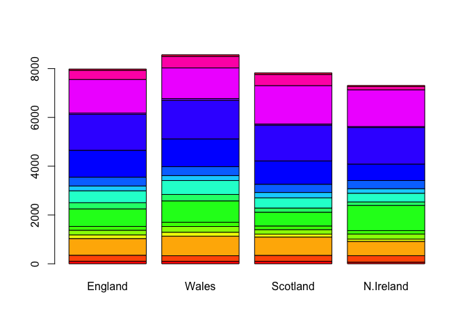
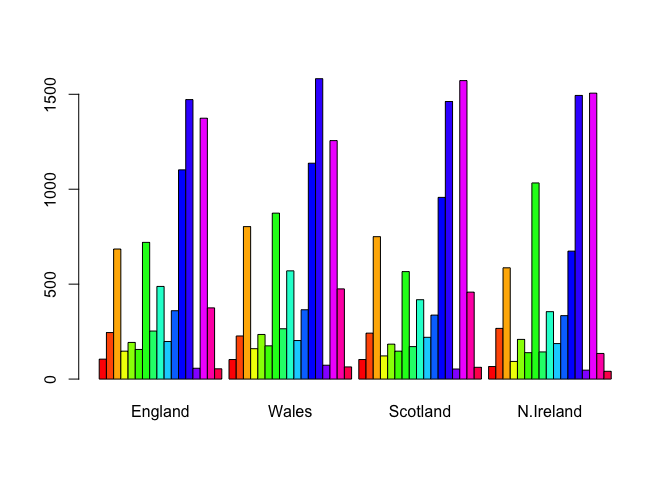
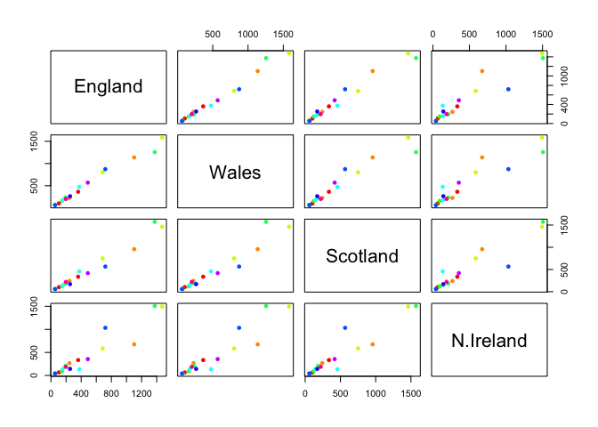
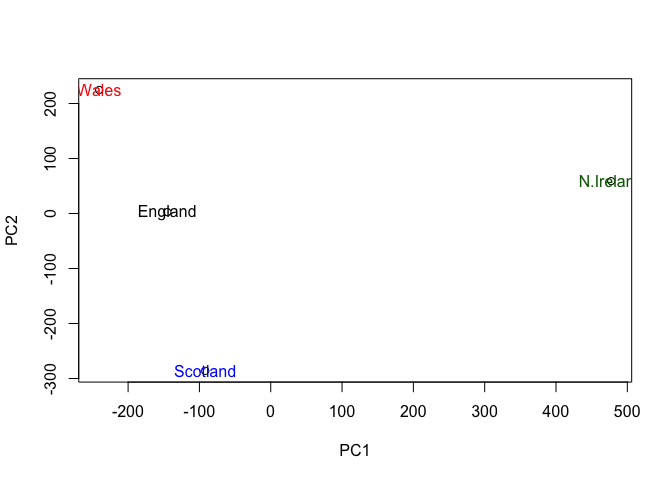
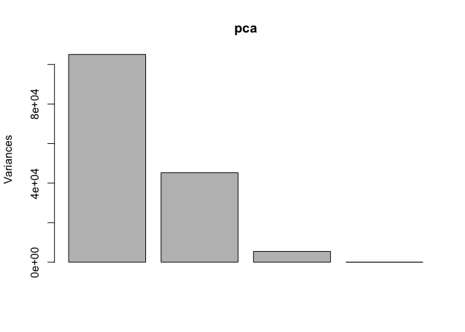

UK Foods: Principal Component Analysis
================

Principal Component Analysis (PCA)
==================================

The main function in base R for PCA is called `prcomp()`. Here we will use PCA to examine the funny food that folks eat in the UK and N. Ireland.

``` r
x <- read.csv("UK_foods.csv")
x
```

    ##                      X England Wales Scotland N.Ireland
    ## 1               Cheese     105   103      103        66
    ## 2        Carcass_meat      245   227      242       267
    ## 3          Other_meat      685   803      750       586
    ## 4                 Fish     147   160      122        93
    ## 5       Fats_and_oils      193   235      184       209
    ## 6               Sugars     156   175      147       139
    ## 7      Fresh_potatoes      720   874      566      1033
    ## 8           Fresh_Veg      253   265      171       143
    ## 9           Other_Veg      488   570      418       355
    ## 10 Processed_potatoes      198   203      220       187
    ## 11      Processed_Veg      360   365      337       334
    ## 12        Fresh_fruit     1102  1137      957       674
    ## 13            Cereals     1472  1582     1462      1494
    ## 14           Beverages      57    73       53        47
    ## 15        Soft_drinks     1374  1256     1572      1506
    ## 16   Alcoholic_drinks      375   475      458       135
    ## 17      Confectionery       54    64       62        41

``` r
x <- read.csv("UK_foods.csv", row.names=1)
x
```

    ##                     England Wales Scotland N.Ireland
    ## Cheese                  105   103      103        66
    ## Carcass_meat            245   227      242       267
    ## Other_meat              685   803      750       586
    ## Fish                    147   160      122        93
    ## Fats_and_oils           193   235      184       209
    ## Sugars                  156   175      147       139
    ## Fresh_potatoes          720   874      566      1033
    ## Fresh_Veg               253   265      171       143
    ## Other_Veg               488   570      418       355
    ## Processed_potatoes      198   203      220       187
    ## Processed_Veg           360   365      337       334
    ## Fresh_fruit            1102  1137      957       674
    ## Cereals                1472  1582     1462      1494
    ## Beverages                57    73       53        47
    ## Soft_drinks            1374  1256     1572      1506
    ## Alcoholic_drinks        375   475      458       135
    ## Confectionery            54    64       62        41

``` r
barplot(as.matrix(x), col=rainbow(nrow(x)))
```



``` r
barplot(as.matrix(x), beside=T, col=rainbow(nrow(x)))
```



``` r
pairs(x, col=rainbow(10), pch=16)
```



``` r
pca <- prcomp(t(x)) 
t(x) #transpose of x
```

    ##           Cheese Carcass_meat  Other_meat  Fish Fats_and_oils  Sugars
    ## England      105           245         685  147            193    156
    ## Wales        103           227         803  160            235    175
    ## Scotland     103           242         750  122            184    147
    ## N.Ireland     66           267         586   93            209    139
    ##           Fresh_potatoes  Fresh_Veg  Other_Veg  Processed_potatoes 
    ## England               720        253        488                 198
    ## Wales                 874        265        570                 203
    ## Scotland              566        171        418                 220
    ## N.Ireland            1033        143        355                 187
    ##           Processed_Veg  Fresh_fruit  Cereals  Beverages Soft_drinks 
    ## England              360         1102     1472        57         1374
    ## Wales                365         1137     1582        73         1256
    ## Scotland             337          957     1462        53         1572
    ## N.Ireland            334          674     1494        47         1506
    ##           Alcoholic_drinks  Confectionery 
    ## England                 375             54
    ## Wales                   475             64
    ## Scotland                458             62
    ## N.Ireland               135             41

``` r
summary(pca)
```

    ## Importance of components:
    ##                             PC1      PC2      PC3       PC4
    ## Standard deviation     324.1502 212.7478 73.87622 4.189e-14
    ## Proportion of Variance   0.6744   0.2905  0.03503 0.000e+00
    ## Cumulative Proportion    0.6744   0.9650  1.00000 1.000e+00

``` r
attributes((pca))
```

    ## $names
    ## [1] "sdev"     "rotation" "center"   "scale"    "x"       
    ## 
    ## $class
    ## [1] "prcomp"

``` r
plot(pca$x[,1], pca$x[,2], xlab="PC1", ylab="PC2")
text(pca$x[,1], pca$x[,2], labels = colnames(x), 
     col=c("black", "red", "blue", "darkgreen"))
```



``` r
plot(pca)
```


