Class 9: Machine Learning pt. 1
================
Sara Elmsaouri
2/5/2020

K-means clustering
------------------

Let's try the `kmeans()` function in R to cluster some made-up example data.

``` r
tmp <- c(rnorm(30,-3), rnorm(30,3))
x <- cbind(x=tmp, y=rev(tmp))
x
```

    ##                x          y
    ##  [1,] -4.5013649  3.5204826
    ##  [2,] -3.5333319  4.6503707
    ##  [3,] -4.3481348  3.2264344
    ##  [4,] -3.2739153  2.7053974
    ##  [5,] -3.2750255  1.9970720
    ##  [6,] -1.3149979  3.4703770
    ##  [7,] -2.8385908  4.4379209
    ##  [8,] -2.7708599  3.3870587
    ##  [9,] -2.4364994  1.2512928
    ## [10,] -1.2423018  5.0038442
    ## [11,] -2.7633817  1.8909344
    ## [12,] -0.3439521  1.7233418
    ## [13,] -2.9112985  3.2016052
    ## [14,] -0.8803999  2.9892111
    ## [15,] -3.3896919  3.6717623
    ## [16,] -3.2031085  3.1250789
    ## [17,] -5.3082800  3.6648763
    ## [18,] -4.2344416  2.6971334
    ## [19,] -2.0338131  3.6564076
    ## [20,] -1.0669834  2.7441020
    ## [21,] -2.0252571  2.7931403
    ## [22,] -4.2344347  3.0759543
    ## [23,] -2.7829149  2.9169727
    ## [24,] -2.0984158  2.0473513
    ## [25,] -4.0645321  4.4783324
    ## [26,] -3.0700341  2.0939260
    ## [27,] -3.1647534  2.9857181
    ## [28,] -4.1295940  1.6689046
    ## [29,] -3.6085540  2.3599035
    ## [30,] -3.9374631  2.7277042
    ## [31,]  2.7277042 -3.9374631
    ## [32,]  2.3599035 -3.6085540
    ## [33,]  1.6689046 -4.1295940
    ## [34,]  2.9857181 -3.1647534
    ## [35,]  2.0939260 -3.0700341
    ## [36,]  4.4783324 -4.0645321
    ## [37,]  2.0473513 -2.0984158
    ## [38,]  2.9169727 -2.7829149
    ## [39,]  3.0759543 -4.2344347
    ## [40,]  2.7931403 -2.0252571
    ## [41,]  2.7441020 -1.0669834
    ## [42,]  3.6564076 -2.0338131
    ## [43,]  2.6971334 -4.2344416
    ## [44,]  3.6648763 -5.3082800
    ## [45,]  3.1250789 -3.2031085
    ## [46,]  3.6717623 -3.3896919
    ## [47,]  2.9892111 -0.8803999
    ## [48,]  3.2016052 -2.9112985
    ## [49,]  1.7233418 -0.3439521
    ## [50,]  1.8909344 -2.7633817
    ## [51,]  5.0038442 -1.2423018
    ## [52,]  1.2512928 -2.4364994
    ## [53,]  3.3870587 -2.7708599
    ## [54,]  4.4379209 -2.8385908
    ## [55,]  3.4703770 -1.3149979
    ## [56,]  1.9970720 -3.2750255
    ## [57,]  2.7053974 -3.2739153
    ## [58,]  3.2264344 -4.3481348
    ## [59,]  4.6503707 -3.5333319
    ## [60,]  3.5204826 -4.5013649

``` r
plot(x)
```

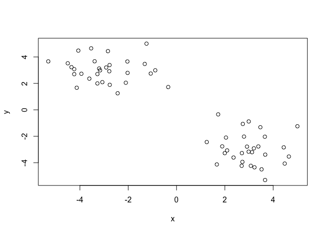

Use the kmeans() function, setting k to 2 and nstart=20. Inspect/print the results.

``` r
km <- kmeans(x, centers=2, nstart=20)
attributes(km)
```

    ## $names
    ## [1] "cluster"      "centers"      "totss"        "withinss"     "tot.withinss"
    ## [6] "betweenss"    "size"         "iter"         "ifault"      
    ## 
    ## $class
    ## [1] "kmeans"

Q. How many points are in each cluster? 30/30

Q. What ‘component’ of your result object details:

-   cluster size? km$size

-   cluster assignment/membership? km$cluster

-   cluster center? km$centers

Let's check how many 2s and 1s are in this vector with the `table()` function

``` r
table(km$cluster)
```

    ## 
    ##  1  2 
    ## 30 30

Plot x colored by the kmeans cluster assignment and add cluster centers as blue points

``` r
plot(x, col=km$cluster, #col=km$centers)
)
```

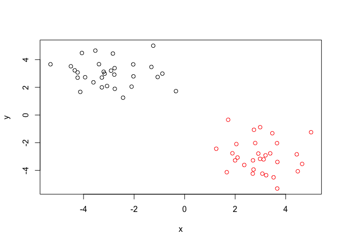

``` r
plot(x,col=c(rep("red", 30), rep("blue", 30)))
```

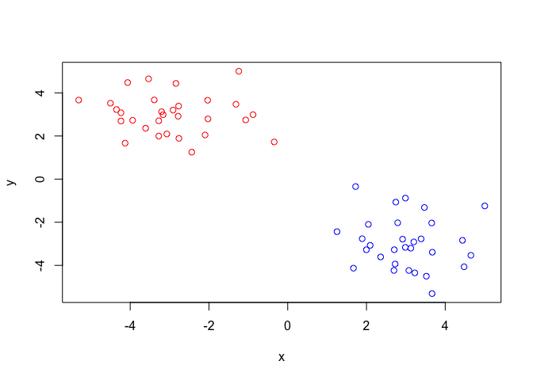

``` r
plot(x, col=km$cluster+1)
```

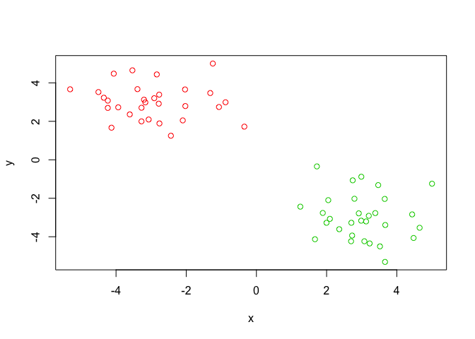

``` r
plot(x, col=km$cluster+2)
```

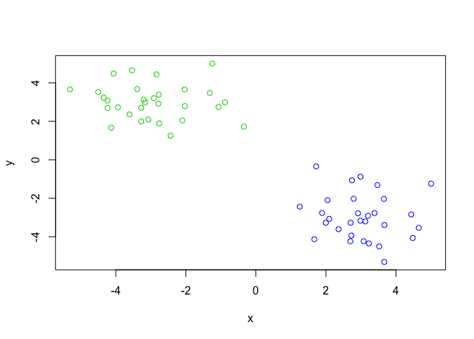

``` r
plot(x, col=km$cluster+3)
```

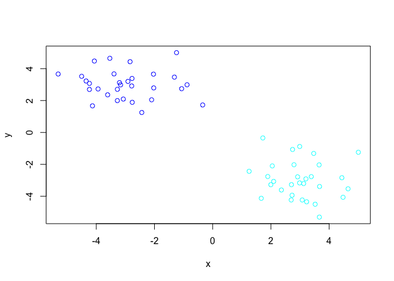

``` r
plot(x, col=km$cluster+4)
```

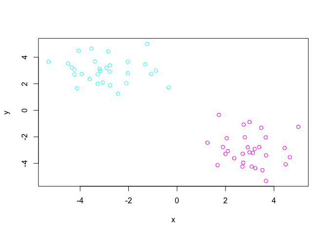

``` r
plot(x, col=km$cluster+5)
```

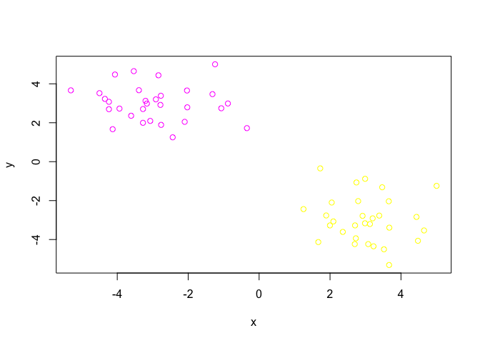

``` r
plot(x, col=km$cluster+6)
```

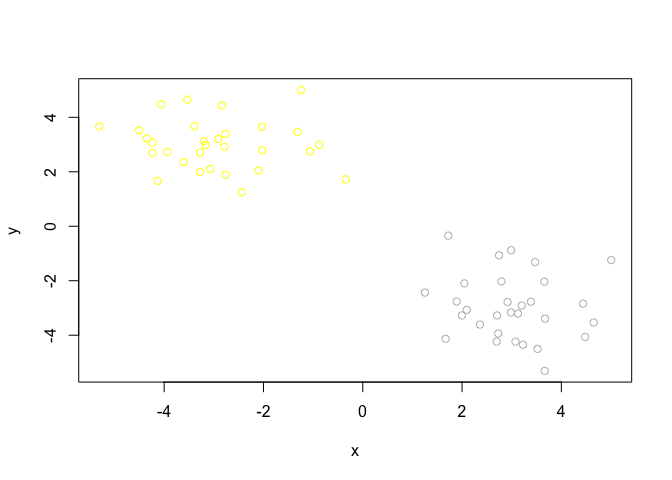

``` r
plot(x, col=km$cluster+7)
```

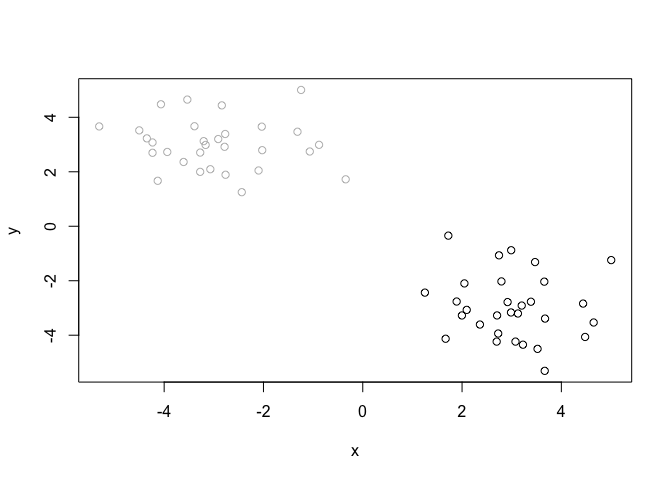

``` r
plot(x, col=km$cluster)
points(km$centers, col="blue", pch=15, cex=3)
```

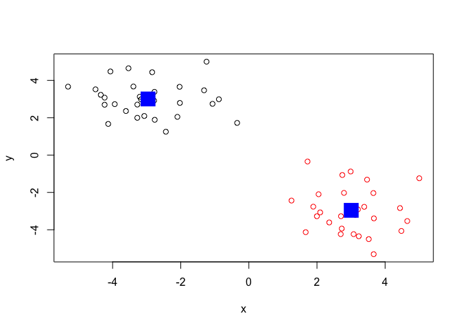

Hierarchical clustering in R
----------------------------

The `hclust()` function is the main Hierarchical clustering method in R and it must be passed a distance matrix as input not your raw data!
===========================================================================================================================================

``` r
hc <- hclust(dist(x))
hc
```

    ## 
    ## Call:
    ## hclust(d = dist(x))
    ## 
    ## Cluster method   : complete 
    ## Distance         : euclidean 
    ## Number of objects: 60

``` r
attributes(hc)
```

    ## $names
    ## [1] "merge"       "height"      "order"       "labels"      "method"     
    ## [6] "call"        "dist.method"
    ## 
    ## $class
    ## [1] "hclust"

``` r
plot(hc)
abline(h=6, col="red", lty=2)
abline(h=3.5, col="blue", lty=2)
```

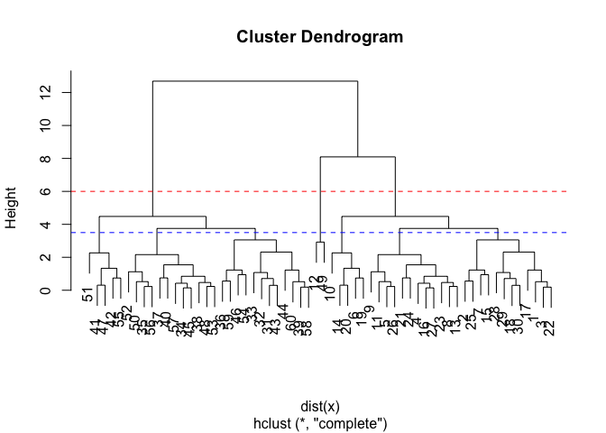

``` r
cutree(hc, h=6)
```

    ##  [1] 1 1 1 1 1 1 1 1 1 1 1 2 1 1 1 1 1 1 1 1 1 1 1 1 1 1 1 1 1 1 3 3 3 3 3 3 3 3
    ## [39] 3 3 3 3 3 3 3 3 3 3 2 3 3 3 3 3 3 3 3 3 3 3

``` r
cutree(hc, h=3.5)
```

    ##  [1] 1 1 1 2 2 3 1 2 2 3 2 4 2 3 1 2 1 1 3 3 2 1 2 2 1 2 2 1 1 1 5 5 5 6 6 5 6 6
    ## [39] 5 6 7 7 5 5 6 5 7 6 4 6 7 6 6 5 7 6 6 5 5 5

``` r
table(cutree(hc,h=3.5))
```

    ## 
    ##  1  2  3  4  5  6  7 
    ## 12 12  5  2 12 12  5

``` r
cutree(hc,k=5)
```

    ##  [1] 1 1 1 1 1 2 1 1 1 2 1 3 1 2 1 1 1 1 2 2 1 1 1 1 1 1 1 1 1 1 4 4 4 4 4 4 4 4
    ## [39] 4 4 5 5 4 4 4 4 5 4 3 4 5 4 4 4 5 4 4 4 4 4

``` r
grp <- cutree(hc,k=5)
x[grp==1]
```

    ##  [1] -4.501365 -3.533332 -4.348135 -3.273915 -3.275025 -2.838591 -2.770860
    ##  [8] -2.436499 -2.763382 -2.911299 -3.389692 -3.203108 -5.308280 -4.234442
    ## [15] -2.025257 -4.234435 -2.782915 -2.098416 -4.064532 -3.070034 -3.164753
    ## [22] -4.129594 -3.608554 -3.937463  3.520483  4.650371  3.226434  2.705397
    ## [29]  1.997072  4.437921  3.387059  1.251293  1.890934  3.201605  3.671762
    ## [36]  3.125079  3.664876  2.697133  2.793140  3.075954  2.916973  2.047351
    ## [43]  4.478332  2.093926  2.985718  1.668905  2.359904  2.727704

``` r
x.grp1 <- x[grp==1]
```

``` r
clust.x.grp1 <- hclust(dist(x.grp1))
```

``` r
plot(clust.x.grp1)
```

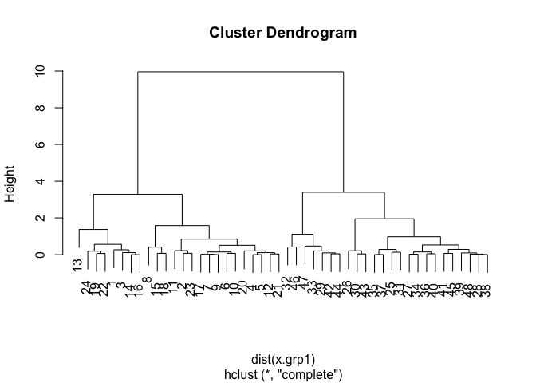

### Some more messy data to cluster

Step 1. Generate some example data for clustering
=================================================

``` r
x <- rbind(
  matrix(rnorm(100, mean=0, sd=0.3), ncol = 2), # c1
  matrix(rnorm(100, mean=1, sd=0.3), ncol = 2), # c2
  matrix(c(rnorm(50, mean=1, sd=0.3), # c3
           rnorm(50, mean=0, sd=0.3)), ncol = 2))
colnames(x) <- c("x", "y")
```

Step 2. Plot the data without clustering
========================================

``` r
plot(x)
```

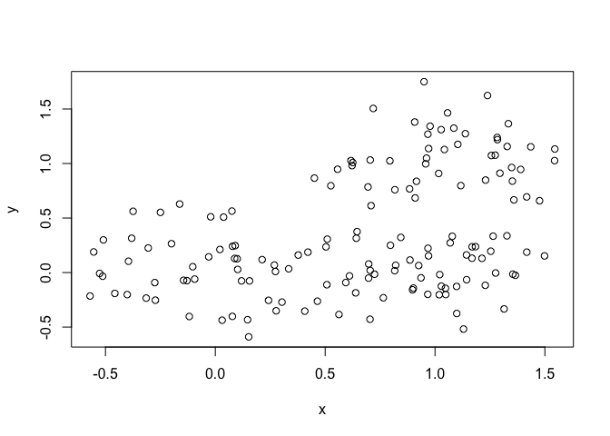

Step 3. Generate colors for known clusters
==========================================

(just so we can compare to hclust results)
==========================================

``` r
col <- as.factor( rep(c("c1","c2","c3"), each=50) )
plot(x, col=col)
```

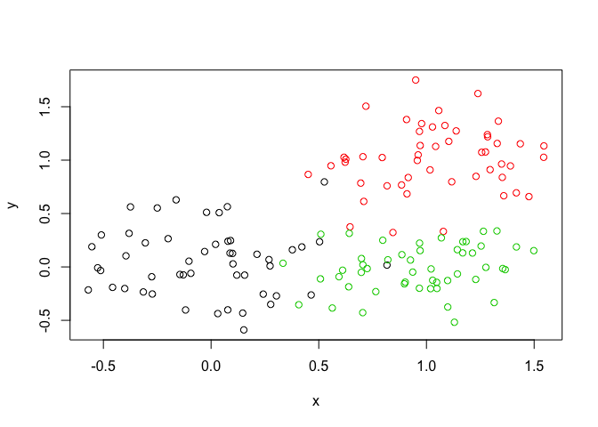

Q. Use the dist(), hclust(), plot() and cutree() functions to return 2 and 3 clusters Q. How does this compare to your known 'col' groups?

``` r
hc <- hclust(dist(x))
plot(hc)
```

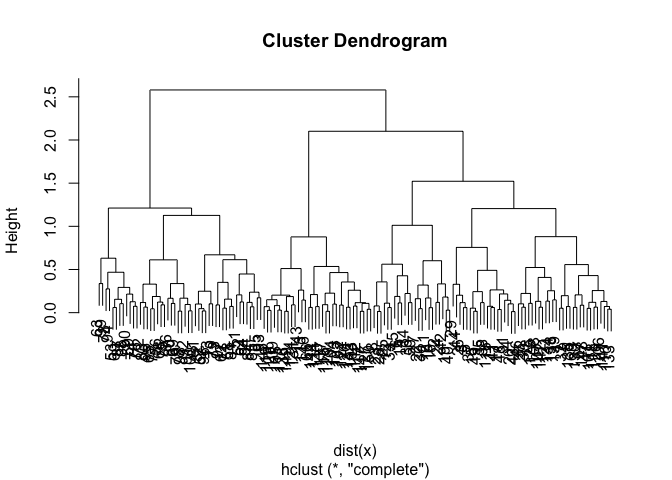

``` r
grps3 <- cutree(hc, k=3)
table(grps3)
```

    ## grps3
    ##  1  2  3 
    ## 70 48 32

``` r
plot(x, col=grps3)
```

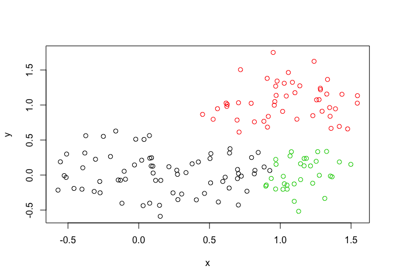

``` r
grps2 <- cutree(hc, k=2)
table(grps2)
```

    ## grps2
    ##   1   2 
    ## 102  48

``` r
plot(x, col=grps2)
```

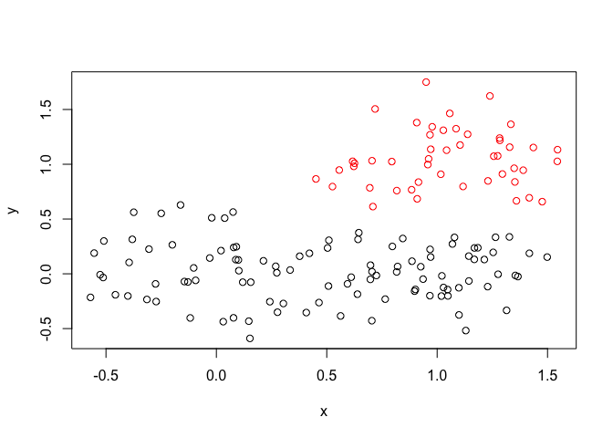

``` r
table(grps3, col)
```

    ##      col
    ## grps3 c1 c2 c3
    ##     1 49  2 19
    ##     2  1 47  0
    ##     3  0  1 31
