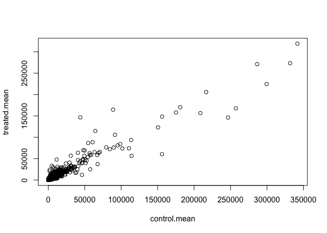
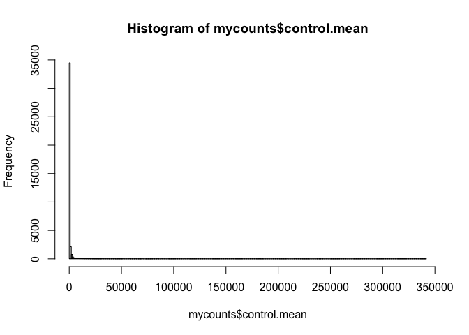
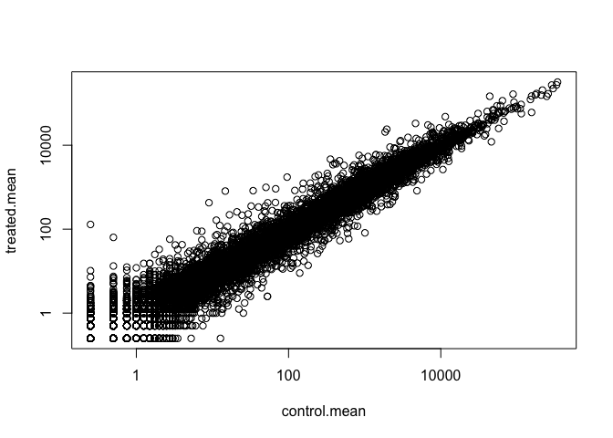

Transcriptomics and the analysis of RNA-Seq data
================

Read our data for today
-----------------------

``` r
counts <- read.csv("airway_scaledcounts.csv", stringsAsFactors = FALSE)
metadata <-  read.csv("airway_metadata.csv", stringsAsFactors = FALSE)
```

``` r
head(counts)
```

    ##           ensgene SRR1039508 SRR1039509 SRR1039512 SRR1039513 SRR1039516
    ## 1 ENSG00000000003        723        486        904        445       1170
    ## 2 ENSG00000000005          0          0          0          0          0
    ## 3 ENSG00000000419        467        523        616        371        582
    ## 4 ENSG00000000457        347        258        364        237        318
    ## 5 ENSG00000000460         96         81         73         66        118
    ## 6 ENSG00000000938          0          0          1          0          2
    ##   SRR1039517 SRR1039520 SRR1039521
    ## 1       1097        806        604
    ## 2          0          0          0
    ## 3        781        417        509
    ## 4        447        330        324
    ## 5         94        102         74
    ## 6          0          0          0

How many genes are we dealing with?

``` r
nrow(counts)
```

    ## [1] 38694

We will compare the control vs treated count data contained in `counts` object.

We will first extract the control columns by looking up their colnames in the `metadata` object.

``` r
x <- 1:5
x > 3
```

    ## [1] FALSE FALSE FALSE  TRUE  TRUE

``` r
x[ x > 3]
```

    ## [1] 4 5

``` r
#metadata
#metadata$dex =="control"

# Access just the "control" metadata
control <- metadata[metadata$dex =="control", ]
head(control)
```

    ##           id     dex celltype     geo_id
    ## 1 SRR1039508 control   N61311 GSM1275862
    ## 3 SRR1039512 control  N052611 GSM1275866
    ## 5 SRR1039516 control  N080611 GSM1275870
    ## 7 SRR1039520 control  N061011 GSM1275874

``` r
#control
```

Access the count colums with control$id

``` r
#counts[ , control$id]
head(counts[ , control$id])
```

    ##   SRR1039508 SRR1039512 SRR1039516 SRR1039520
    ## 1        723        904       1170        806
    ## 2          0          0          0          0
    ## 3        467        616        582        417
    ## 4        347        364        318        330
    ## 5         96         73        118        102
    ## 6          0          1          2          0

Now find the mean value for each gene (i.e. each row)

``` r
# Now find the mean value for each gene (i.e. each row)
control.mean <- rowSums(counts[ , control$id])/ nrow(control)
names(control.mean) <- counts$ensgene
```

Now do the same for "treated" samples

``` r
treated <- metadata[metadata$dex =="treated", ]
treated.mean <- rowMeans(counts[,treated$id])
```

Let's put these together for ease of use

``` r
mycounts <- data.frame(control.mean, treated.mean)
```

Lets just plot our data

``` r
plot(mycounts)
```



``` r
hist(mycounts$control.mean, breaks = 300)
```



Our data is very skewed so lets work with logs. First re-plot our control vs treated on a log-log scale

``` r
plot(mycounts, log="xy")
```

    ## Warning in xy.coords(x, y, xlabel, ylabel, log): 15032 x values <= 0 omitted
    ## from logarithmic plot

    ## Warning in xy.coords(x, y, xlabel, ylabel, log): 15281 y values <= 0 omitted
    ## from logarithmic plot



Lets remove our zero count genes because we can't say anything about them from this dataset!

``` r
x <- data.frame( c(1, 3, 10, 0),
                 c(1, 3, 0,  0) )
x
```

    ##   c.1..3..10..0. c.1..3..0..0.
    ## 1              1             1
    ## 2              3             3
    ## 3             10             0
    ## 4              0             0

``` r
unique(which(x == 0, arr.ind = TRUE)[,"row"] )
```

    ## [1] 4 3

Ok, find zero rows in our mycounts object

``` r
to.rm <- unique(which(mycounts == 0, arr.ind = TRUE)[,"row"] )
newcounts <- mycounts[-to.rm,]
```

How many genes have we now?

``` r
nrow(newcounts)
```

    ## [1] 21817

Here we calculate log2foldchange, add it to our meancounts data.frame and inspect the results either with the head() or the View() function for example.

``` r
newcounts$log2fc <- log2(newcounts[,"treated.mean"]/newcounts[,"control.mean"])
head(newcounts)
```

    ##                 control.mean treated.mean      log2fc
    ## ENSG00000000003       900.75       658.00 -0.45303916
    ## ENSG00000000419       520.50       546.00  0.06900279
    ## ENSG00000000457       339.75       316.50 -0.10226805
    ## ENSG00000000460        97.25        78.75 -0.30441833
    ## ENSG00000000971      5219.00      6687.50  0.35769358
    ## ENSG00000001036      2327.00      1785.75 -0.38194109

A common rule of thumb in the field is to use a log2fc (fold change) of greater than +2 as *up regulated* and less than -2 as *down regulated*.

How many of our genes are up regulated upon this drug treatment?

``` r
sum(newcounts$log2fc > 2)
```

    ## [1] 250

How many are down at this threshold?

``` r
sum(newcounts$log2fc < -2)
```

    ## [1] 367

Lets use DESeq2
---------------

Run these installations in the console:
=======================================

-   install.packages("BiocManager")

-   BiocManager::install()

For this class, you'll also need DESeq2:
========================================

``` r
#library(BiocManager)
#library(DESeq2)

source("http://bioconductor.org/biocLite.R")
```

    ## Bioconductor version 3.4 (BiocInstaller 1.24.0), ?biocLite for help

    ## A new version of Bioconductor is available after installing the most recent
    ##   version of R; see http://bioconductor.org/install

``` r
biocLite()
```

    ## BioC_mirror: https://bioconductor.org

    ## Using Bioconductor 3.4 (BiocInstaller 1.24.0), R 3.3.3 (2017-03-06).

    ## Old packages: 'bit', 'checkmate', 'cluster', 'data.table', 'Hmisc',
    ##   'KernSmooth', 'Matrix', 'mgcv', 'RcppArmadillo', 'RSQLite', 'XML'

``` r
biocLite("DESeq2")
```

    ## BioC_mirror: https://bioconductor.org

    ## Using Bioconductor 3.4 (BiocInstaller 1.24.0), R 3.3.3 (2017-03-06).

    ## Installing package(s) 'DESeq2'

    ## 
    ## The downloaded binary packages are in
    ##  /var/folders/l2/t47b6z5x4z9_zff7qq4wj7dh0000gn/T//RtmprAGHDY/downloaded_packages

    ## Old packages: 'bit', 'checkmate', 'cluster', 'data.table', 'Hmisc',
    ##   'KernSmooth', 'Matrix', 'mgcv', 'RcppArmadillo', 'RSQLite', 'XML'

Setup the object required by DESeq

``` r
#dds <- DESeqDataSetFromMatrix(countData=counts,
                              #colData=metadata,
                              #design=~dex,
                              #tidy=TRUE)
#dds
```

``` r
#dds <- DESeq(dds)
```

``` r
#res <- results(dds)
#res
```

Volcano plots
-------------

Plot of log2fc vs p-value

``` r
#plot(res$log2FoldChange, -log(res$padj), col="gray")
#abline(v=c(-2,+2), lty=2)
#abline(h=-log(0.05), lty=2)
```
